# SQL Notes

## Relational Databases

### Learn SQL[^1]

- The basic syntax of querying a SQL database includes: `SELECT`, `FROM`, `ORDER BY`, `LIMIT`, `OFFSET`. Conditions can be added using `WHERE` with opeartors, `GROUP BY`, aggregate function. Multi-table querying can be completed using `JOIN`.
- We can add or delete table by using `CREATE TABLE IF NOT EXISTS mytable` and `DROP TABLE IF EXISTS mytable`
- A table can be altered using `ALTER TABLE mytable`, where commands like `ADD column, dataTyle, Optional constraint, DEFAULT` can be added; same thing applies to remove columns, using `DROP`

### Screenshots of SQL Bolt Tutorials

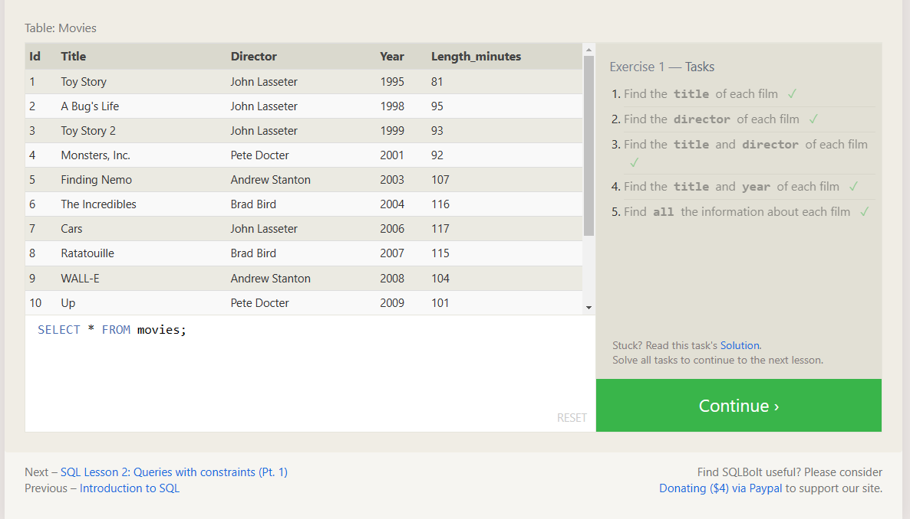
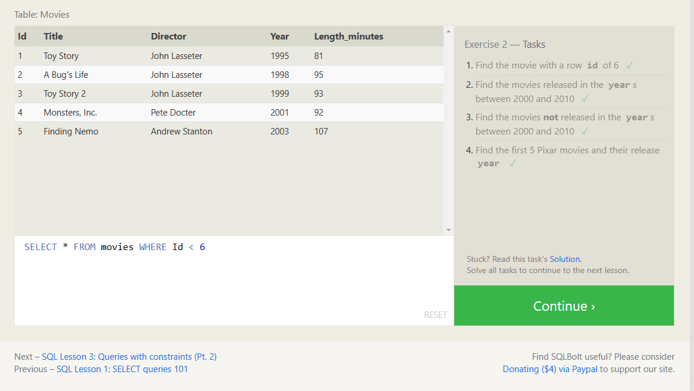
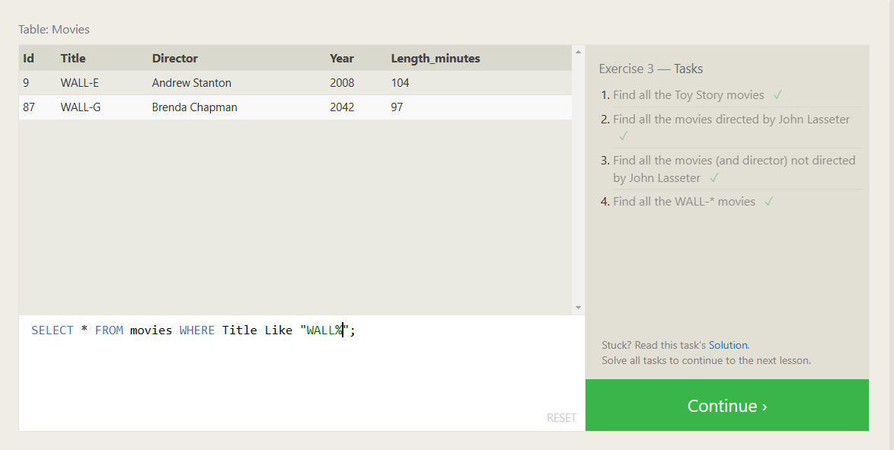
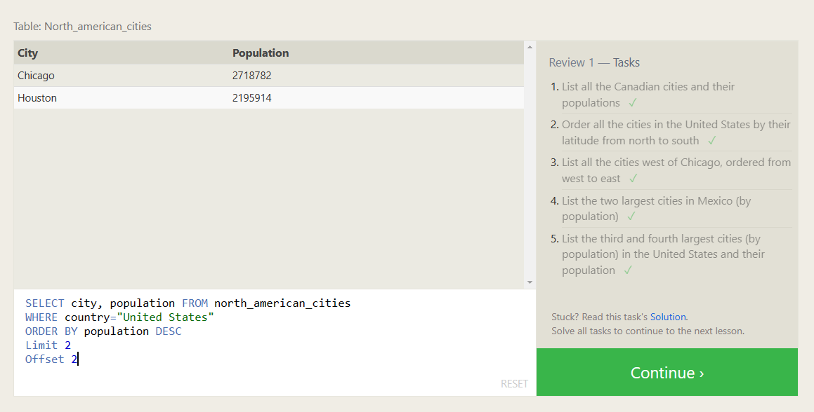
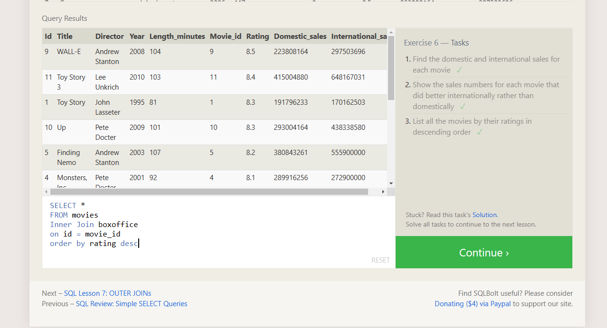
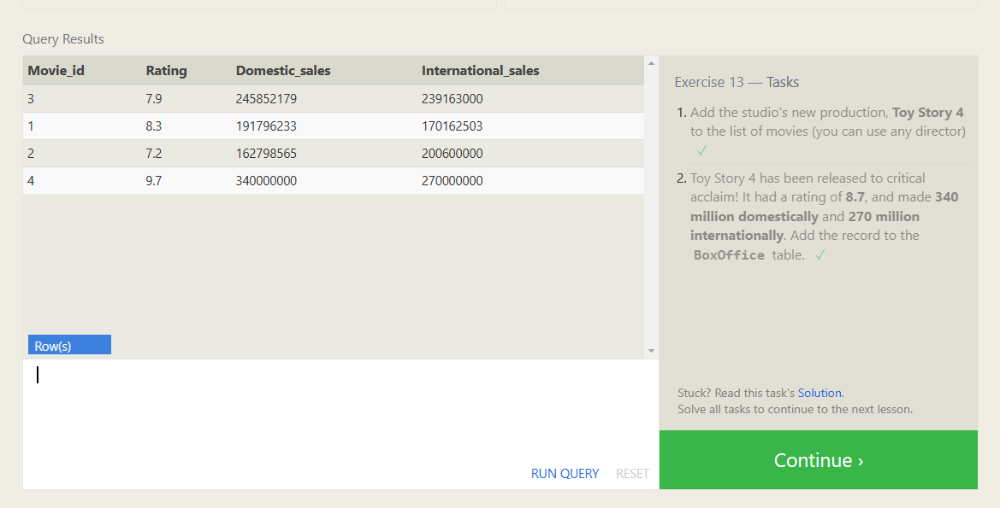
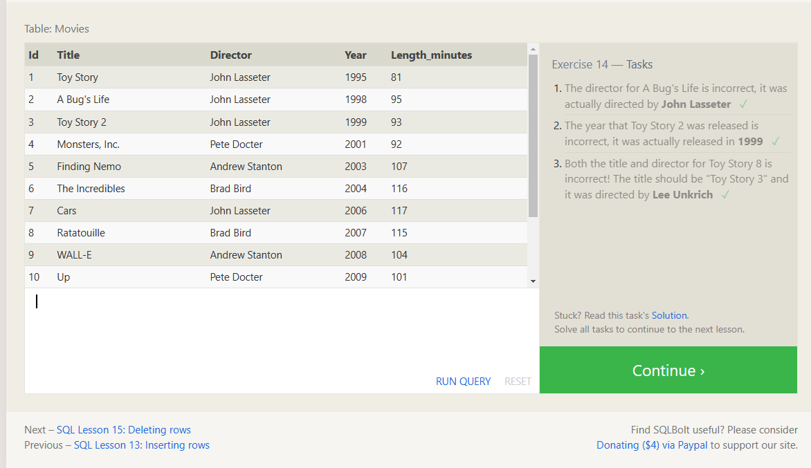
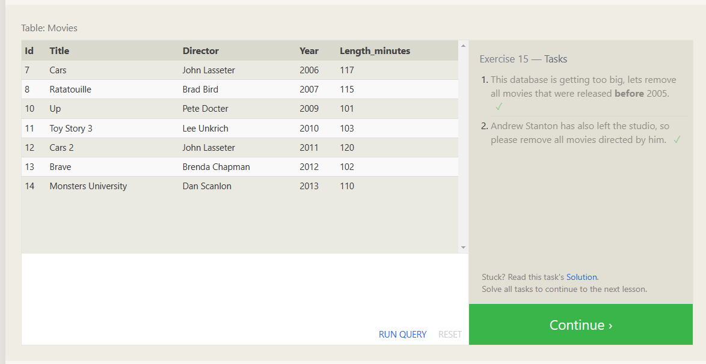
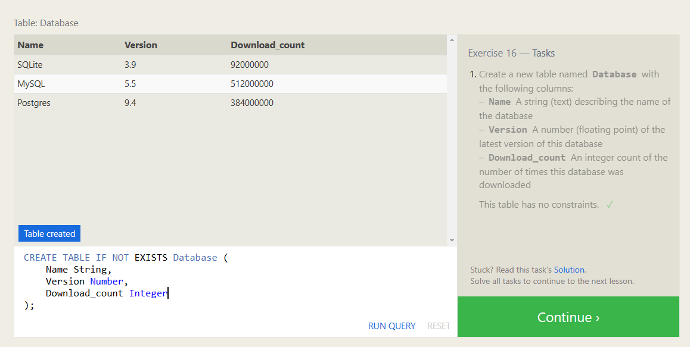
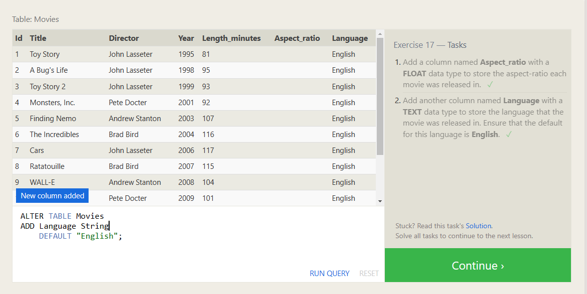
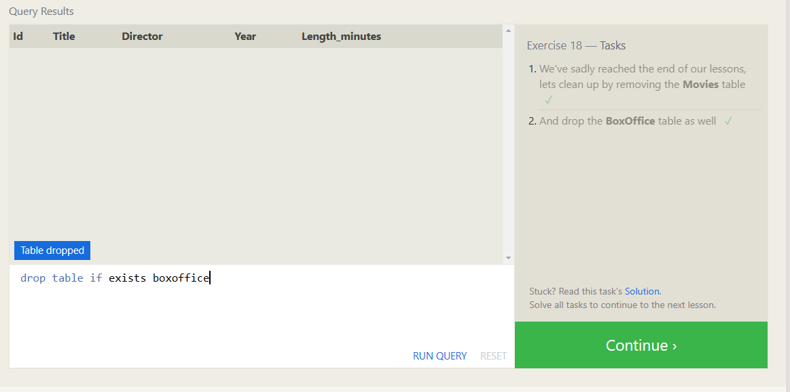

## Things I want to know more about

 [Back to main page](https://mirandalu2020.github.io/reading-notes/)

## References

[^1]:https://cdn2.hubspot.net/hubfs/392937/Learn%20SQL.pdf